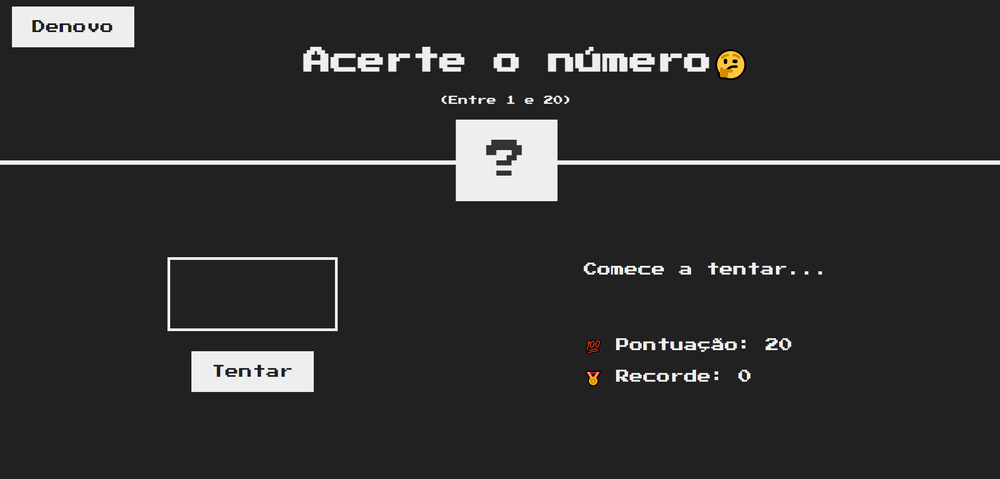

# guessTheNumber

## Demo

## Fazendo um jogo com JS praticando o DOM, em que você tem que acertar um número secreto entre 1 e 20! Com função de score, highscore, try again e até mesmo umas dicas para você saber em que direção ir! Será que você consegue descobrir na sua primeira tentativa?🤔
